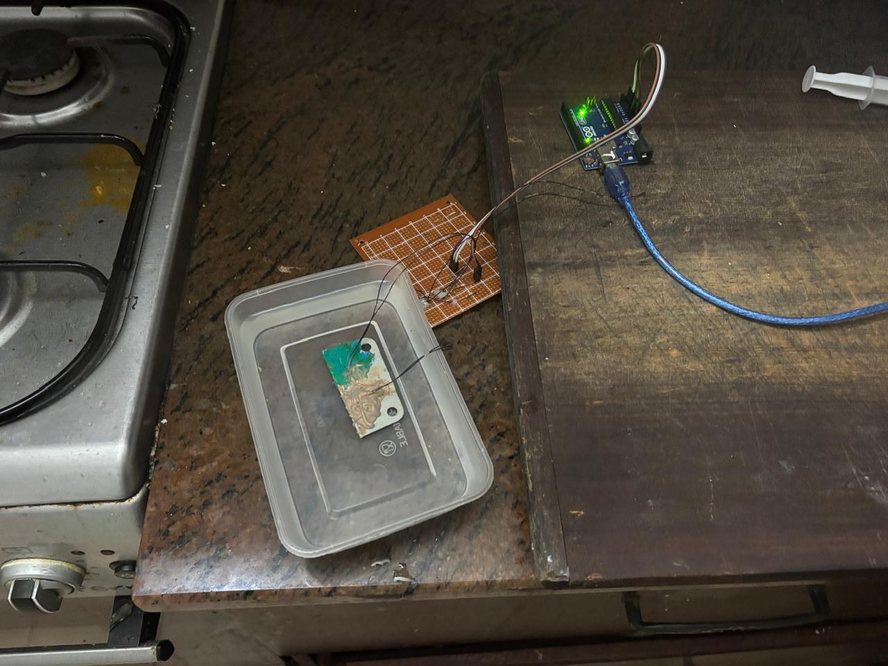
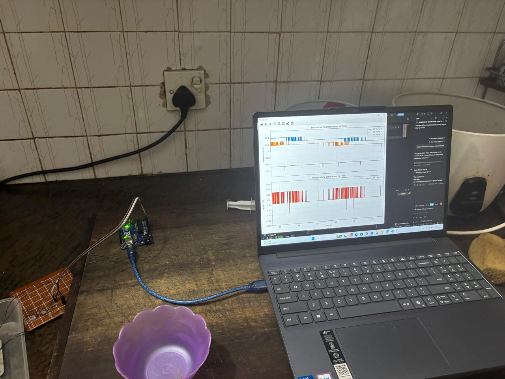
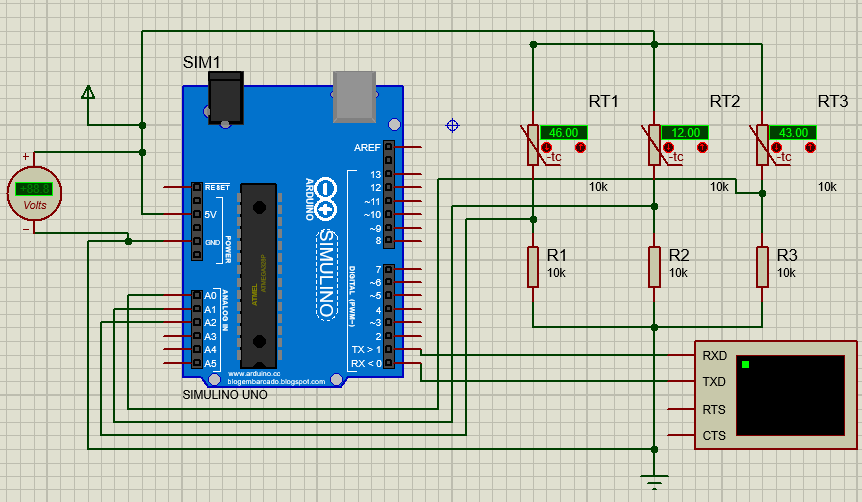

# Thermistor Analysis for EV 5.8.4 Derating

## Project Scope
This repository supports the temperature-derating justification work described in `SES details.docx`.

The project objective is to demonstrate compliance with EV 5.8.4:

- If thermal adhesive is used to ensure contact between the cell and the temperature sensor, the maximum monitored temperature must be appropriately derated in the ESF.

The work compares paired thermistor readings under multiple setups and operating conditions, then derives a conservative shutdown derating value based on steady-state temperature offsets.

## Repository Contents
- `thermistor_stream.ino`
  - Arduino sketch for streaming raw thermistor channels over serial at 10 Hz.
  - CSV output header: `tick_ms,a0,a1,a2`
- `thermistor_logger.py`
  - Python logger for:
    - reading Arduino serial data (`tick_ms,a0,a1,a2`),
    - converting raw ADC to temperature in C using Beta-model constants,
    - saving CSV with `time_s`, `a0_temp_c`, `a1_temp_c`, `a2_temp_c`, and delta,
    - plotting live temperature and delta trends.
- `derive_derated_shutdown.py`
  - Python analysis script that:
    - reads processed temperature CSV data,
    - detects steady-state intervals,
    - computes sensor offset statistics,
    - derives derated shutdown temperatures.
- `img/`
  - Setup and reference images used for documentation.
- `SES details.docx`
  - Main technical/report document containing setups, observations, equations, and conclusions.

## Setup Images
The following photos show the physical setup used during thermistor comparison and logging.

<p align="center">
  
  
  <br>
  
  
</p>

## Analysis Method (Implemented in Python)
The script applies a steady-state filtered approach to reduce transient bias:

1. Read input data with columns:
   - `time_s`
   - `a0_temp_c`
   - `a1_temp_c`
2. Compute offset:
   - `delta_t = a0_temp_c - a1_temp_c`
3. Detect steady-state windows using:
   - window length: 5 s,
   - slope threshold: 0.08 C/s for each channel,
   - offset standard deviation threshold: 0.35 C,
   - minimum steady segment duration: 15 s.
4. For detected steady-state samples, compute:
   - mean offset,
   - 95th percentile offset,
   - max offset.
5. Derive shutdown limits using a 60.0 C cell limit:
   - conservative derated shutdown: `60.0 - max_offset`,
   - robust derated shutdown: `60.0 - p95_offset`.

## How to Use

### 0) Install Python dependencies

```powershell
python -m pip install pyserial matplotlib
```

### 1) Stream data from Arduino
1. Flash `thermistor_stream.ino` to the board.
2. Ensure serial output format is:
  - `tick_ms,a0,a1,a2`

### 2) Log and convert with thermistor_logger.py
Run the logger to capture serial data, convert to temperatures, and save CSV:

```powershell
python thermistor_logger.py --port COM5 --baud 115200 --csv temperature_readings.csv --window 120
```

If `--port` is omitted, the script attempts to auto-detect a serial port.

Generated CSV includes the columns needed by derating analysis, including:

```csv
time_s,a0_temp_c,a1_temp_c
```

Notes:
- `time_s` is generated from Arduino tick time.
- temperature channels are converted to Celsius by the logger.

### 3) Run derating analysis

```powershell
python derive_derated_shutdown.py --input temperature_readings.csv
```

Optional outputs:

```powershell
python derive_derated_shutdown.py \
  --input your_data.csv \
  --processed-output processed_with_steps.csv \
  --step-summary-output step_summary.csv \
  --overall-summary-output derating_summary.csv
```

## Output Files
The analysis script writes three CSV files:

- Processed output:
  - input data plus:
    - `delta_t_a0_minus_a1_c`
    - `process_step`
    - `is_steady_state`
- Step summary:
  - one row per detected steady-state segment with segment-level offset statistics.
- Overall summary:
  - final derating metrics including:
    - `derated_shutdown_temp_c_from_max`
    - `derated_shutdown_temp_c_from_p95`

## Notes and Assumptions
- Current code assumes input temperatures are already calibrated and in Celsius.
- The script uses only A0 and A1 for derating analysis.
- Threshold constants are defined near the top of `derive_derated_shutdown.py` and can be tuned for different noise/environment conditions.

## Suggested Next Improvements
- Add a calibration workflow (per sensor channel) to improve absolute temperature accuracy.
- Add plotting for setup-wise comparison and steady-state detection visualization.
- Add sample input/output datasets for reproducible validation.
